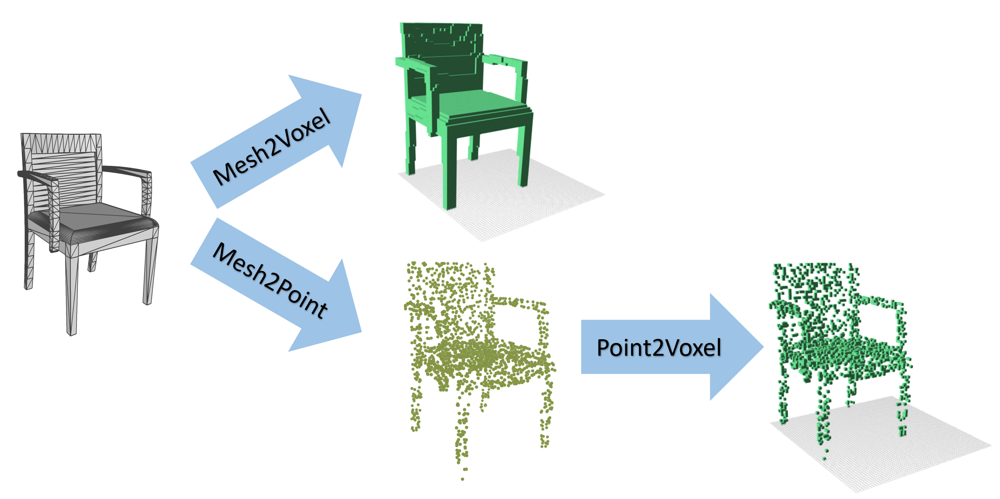

# Mini-script to convert and rename shapenet dataset

This repository contains very simple mini-scripts to convert shapenet models to voxel grids and point clouds.




## Usage
* Demo
```
python demo.py --shapenet_root shapenet --category_name 03001627 --output_root shapenet_convert
```
This demo takes as input the path to the root directory of the shapenet dataset and the name of a category. 

It first converts the mesh models (.obj) to point clouds (.ply) by ramdom sampling, then converts the sampled point clouds to voxels (.binvox) and finally converts the original mesh models to voxels (.binvox). The results are renamed and saved in `shapenet_convert`.

* Rename

The original file structure of a category in shapenet, where we are only interested in the shape id and model_normalized.obj.
```
shapenet_root
└─03001627
    ├─1a6f615e8b1b5ae4dbbc9440457e303e
    │  ├─images
    │  │      texture0.jpg
    │  │      texture1.jpg
    │  │
    │  └─models
    │          model_normalized.json
    │          model_normalized.mtl
    │          model_normalized.obj
    │
    ├─1a74a83fa6d24b3cacd67ce2c72c02e
    │  ├─images
    │  │      texture0.jpg
    │  │
    │  └─models
    │          model_normalized.json
    │          model_normalized.mtl
    │          model_normalized.obj
    │
    └─1a8bbf2994788e2743e99e0cae970928
        ├─images
        │      texture0.jpg
        │      texture1.jpg
        │
        └─models
                model_normalized.json
                model_normalized.mtl
                model_normalized.obj
```

The file structure of the output folder after running the demo

```
shapenet_convert
└─03001627
    ├─pc
    │      1a6f615e8b1b5ae4dbbc9440457e303e.ply
    │      1a74a83fa6d24b3cacd67ce2c72c02e.ply
    │      1a8bbf2994788e2743e99e0cae970928.ply
    │
    ├─pc_vox
    │      1a6f615e8b1b5ae4dbbc9440457e303e.binvox
    │      1a74a83fa6d24b3cacd67ce2c72c02e.binvox
    │      1a8bbf2994788e2743e99e0cae970928.binvox
    │
    └─vox
            1a6f615e8b1b5ae4dbbc9440457e303e.binvox
            1a74a83fa6d24b3cacd67ce2c72c02e.binvox
            1a8bbf2994788e2743e99e0cae970928.binvox
```

## Code
* Installation

You need to install [NumPy](https://numpy.org/) and [PyntCloud](https://github.com/daavoo/pyntcloud). 
This code is tested under Python 3.7.4, NumPy 1.17.2 on Windows 10. We ackonwledge the code and tools from [binvox](https://www.patrickmin.com/binvox/).

* Linux version

Changing the code to a linux version should be trival

